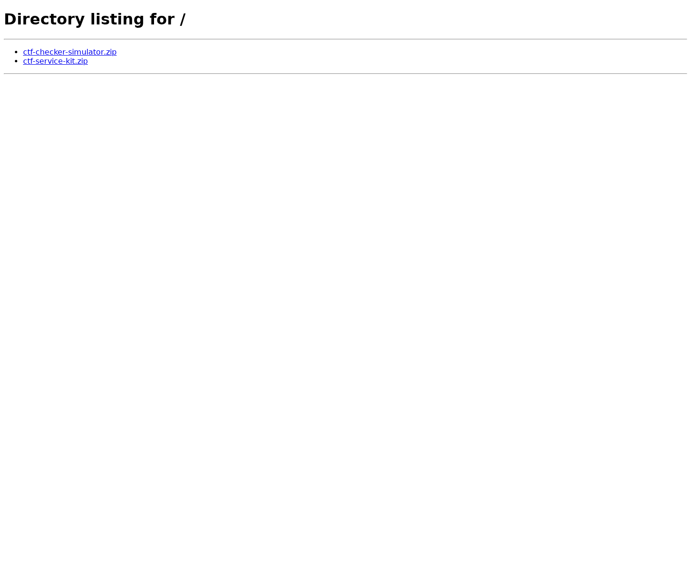

# ctf-download-server-files-1

This report combines static inspection and dynamic observations. Pattern names are neutral review cues, not conclusions.

## Overview

| Field | Value |
|---|---|
| Container | ctf-download-server-files-1 (`cdcbed8df90e`) |
| Image | `python:3.13-alpine` |
| Classification | web |
| Languages | Python (1) |
| Ports | 0.0.0.0:8090 → 8090/tcp, :::8090 → 8090/tcp |
| Files inspected | 1 |
| Compose project/service | `ctf-download-server` / `files` |
| Compose project containers | 1 |

## Interesting patterns to inspect

These locations matched review-oriented source patterns. Inspect the surrounding code and runtime behavior before drawing conclusions.

No configured source pattern matched.

## Cross-file relationships to trace

Compared definitions, references, and patterns across 1 source file(s). These links identify code paths worth following; they do not assert runtime data flow.

No review-pattern relationship crossed a file boundary.

No defined symbol was referenced from another inspected file.

## Routes and entry points

No route was recognized by the static patterns.

## Package and build context

No recognized package or build manifest was found.

## Native and binary artifacts

No binary artifact was selected.

## Runtime context

- Command: `python -m http.server 8090 --bind 0.0.0.0 --directory /downloads`
- Working directory: `/`
- Container user: `65534:65534`
- Running processes at collection: 1
- Environment variable names: GPG_KEY, PATH, PYTHON_SHA256, PYTHON_VERSION

Configuration details to review:
- Container root filesystem is writable.

## Dynamic observations

- Target IP: `51.158.179.106`
- Timeout per operation: 15 seconds

### Web endpoint on TCP 8090

Start URL: `http://51.158.179.106:8090/`

| Status | URL | Type | Bytes | Saved response |
|---:|---|---|---:|---|
| 200 | `http://51.158.179.106:8090/` | text/html | 325 | [responses/0001-root-c5c8ef0ff8.html](web-8090/responses/0001-root-c5c8ef0ff8.html) |
| 200 | `http://51.158.179.106:8090/ctf-checker-simulator.zip` | application/zip | 10543 | [responses/0002-ctf-checker-simulator.zip-e36e64140c.body](web-8090/responses/0002-ctf-checker-simulator.zip-e36e64140c.body) |
| 200 | `http://51.158.179.106:8090/ctf-service-kit.zip` | application/zip | 41011 | [responses/0003-ctf-service-kit.zip-4151eaae29.body](web-8090/responses/0003-ctf-service-kit.zip-4151eaae29.body) |

Captured screenshots:

`http://51.158.179.106:8090/`

## Inspected source files

- `source/compose.yaml`
