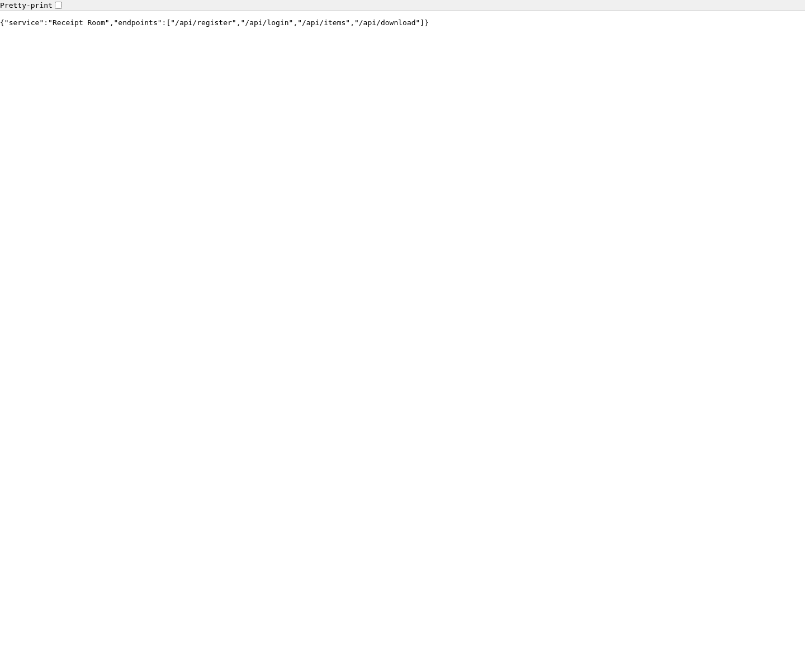

Note: Dumb quick analysis with naive deterministic checking. Only for situational awareness.

# ctf-web-java-web-java-1

This report combines static inspection and dynamic observations. Pattern names are neutral review cues, not conclusions.

## Overview

| Field | Value |
|---|---|
| Container | ctf-web-java-web-java-1 (`311216cb87bc`) |
| Image | `ctf-web-java-web-java` |
| Classification | web |
| Classification signals | Web technology: JDK HttpServer |
| Languages | Java (2) |
| Ports | 0.0.0.0:8084 → 8084/tcp, :::8084 → 8084/tcp |
| Files inspected | 4 |
| Compose project/service | `ctf-web-java` / `web-java` |
| Compose project containers | 1 |

## Interesting patterns to inspect

These locations matched review-oriented source patterns. Inspect the surrounding code and runtime behavior before drawing conclusions.

| Pattern | File and line | Observed line |
|---|---|---|
| Authorization decision | `source/App.java:116` | `String authorization = exchange` |
| Authorization decision | `source/App.java:118` | `.getFirst("Authorization");` |
| Authorization decision | `source/App.java:120` | `if (authorization == null \|\| !authorization.startsWith("Bearer ")) {` |
| Authorization decision | `source/App.java:124` | `String[] token = authorization.substring(7).split("\\.", 2);` |
| File write | `source/App.java:195` | `Files.write(Path.of("/data/users.db"), userLines);` |
| File write | `source/App.java:196` | `Files.write(Path.of("/data/items.db"), itemLines);` |
| File read | `source/App.java:206` | `for (String line : Files.readAllLines(userFile)) {` |
| File read | `source/App.java:217` | `for (String line : Files.readAllLines(itemFile)) {` |
| Authorization decision | `source/App.java:313` | `// Intentionally vulnerable: authenticated ownership is not checked (IDOR).` |
| File read | `source/App.java:337` | `"{\"content\":\"" + escape(Files.readString(file)) + "\"}"` |
| File write | `source/App.java:417` | `Files.writeString(welcome, "Receipt Room export service\n");` |
| Authorization decision | `source/CHALLENGE.md:4` | `Review object authorization, token trust, and path resolution. Existing user tokens do not` |

## Routes and entry points

No route was recognized by the static patterns.

## Package and build context

No recognized package or build manifest was found.

## Native and binary artifacts

No binary artifact was selected.

## Runtime context

- Command: `/__cacert_entrypoint.sh java App`
- Working directory: `/app`
- Container user: `10001:10001`
- Running processes at collection: 1
- Environment variable names: JAVA_HOME, JAVA_VERSION, LANG, LANGUAGE, LC_ALL, PATH

Configuration details to review:
- Container root filesystem is writable.
- Writable volume at /data

## Dynamic observations

- Target IP: `51.158.179.106`
- Timeout per operation: 15 seconds

### Web endpoint on TCP 8084

Start URL: `http://51.158.179.106:8084/`

| Status | URL | Type | Bytes | Saved response |
|---:|---|---|---:|---|
| 200 | `http://51.158.179.106:8084/` | application/json | 98 | [responses/0001-root-2839c9b8c3.body](web-8084/responses/0001-root-2839c9b8c3.body) |

Captured screenshots:

`http://51.158.179.106:8084/`

## Inspected source files

- `source/App.java`
- `source/CHALLENGE.md`
- `source/Dockerfile`
- `source/compose.yaml`
